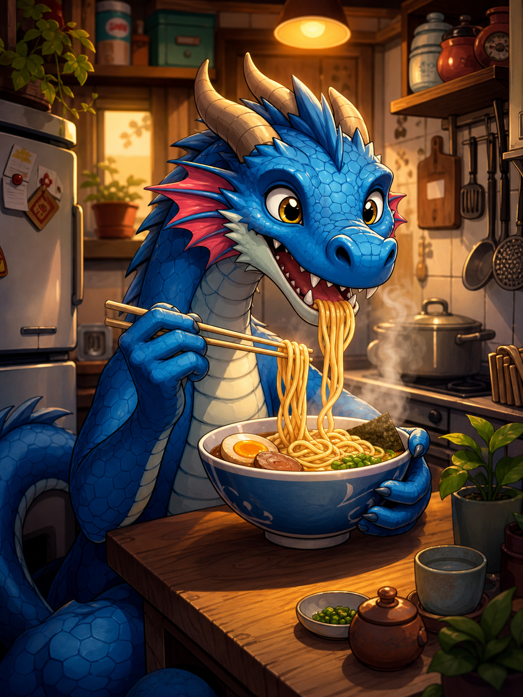

# Showcase

A friendly visual for the guide, inspired by the repeated test generations that exposed the Open WebUI prompt mapping issue.



The important technical fix remains the prompt mapping:

```json
{"type": "prompt", "node_ids": ["4"], "key": "text"}
```

If Open WebUI keeps generating the same image no matter what prompt you type, check that mapping first.
